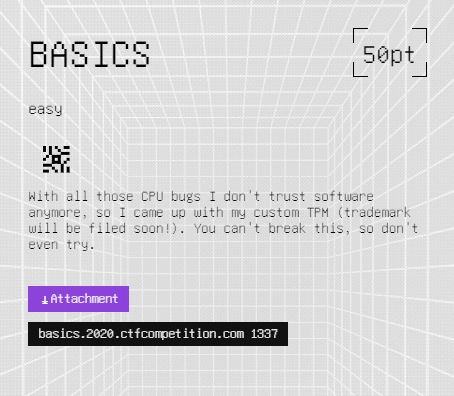

# [Hardware] Basics

This task was part of the 'Hardware' category at the 2020 Google CTF (during 22-23 August 2020).

While I don't usually deal with hardware, I know that Google CTFs can be a great opportunity to learn new things, so after having a great time solving [Back to the Basics](../../Google-CTF-2018-Quals/back-to-the-basics) from 2 years ago, I decided to try the challenge that was tagged "easy".

## The Challenge

The challenge description reads:



and we are given this [attachment](attachment.zip).

## Exploring (C++)

We are given 2 files: `main.cpp` and `check.sv`.

I know what `cpp` is, so let's start with it:

```cpp
#include "obj_dir/Vcheck.h"

#include <iostream>
#include <memory>

int main(int argc, char *argv[]) {
	Verilated::commandArgs(argc, argv);
	std::cout << "Enter password:" << std::endl;
	auto check = std::make_unique<Vcheck>();

	for (int i = 0; i < 100 && !check->open_safe; i++) {
		int c = fgetc(stdin);
		if (c == '\n' || c < 0) break;
		check->data = c & 0x7f;
		check->clk = false;
		check->eval();
		check->clk = true;
		check->eval();
	}
	if (check->open_safe) {
		std::cout << "CTF{real flag would be here}" << std::endl;
	} else {
		std::cout << "=(" << std::endl;
	}
	return 0;
}
```

It seems to be pretty short, so probably the real challenge is in that other file and this one somehow uses it, so let's understand this one first.

It first includes some local file called `Vcheck.h` which isn't provided to us.
It defines a `main` function, which calls `Verilated::commandArgs`.
`Verliated` is not from C++'s standard library, so I assume it came from the header we don't have.
It then creates an instance of `Vcheck` which I know for sure is coming from the unknown header because of its name.

After that it loops a hundred times and reads a character as input, and it looks like it does some weird stuff with the `Vcheck` object, and finally prints the flag only if the `open_safe` member on the object is `true`.

Weird. It looks like all this does has to do with stuff that come from the header we don't know. Let's see if we can find out more.
The program calls `Verilated::commandArgs` which we know is from that header, so let's google `Verilated`:
I found [this](https://github.com/djg/verilated-rs), a Rust library called `Verilated` which seems to wrap some other library called `Verilator`.
But the code we see is C++ and not Rust, so maybe let's google this `Verilator`: this gives us [Verilator's website](https://www.veripool.org/wiki/verilator).

On Verilator's website we found, it says: *Welcome to Verilator, the fastest Verilog/SystemVerilog simulator.*

Scrolling down it says that it is used with C++, so that checks out.

So we're dealing with a Verilog simulator, so I guess this other file that we got, `check.sv`, is probably some Verilog code being run using Verilator. I don't know anything about Verilog or about how it works, so this will be interesting.

I'm still not sure about this since the namespace that the C++ code uses is called `Verilated` and not `Verilator` which are different libraries, but maybe the Rust library got its name from that namespace.

Now that I think about it, the second file's name - `check.sv` - reminds me of the header `Vcheck.h`.
So Maybe they used this Verilator thing to generate that header from the `sv` file to connect it to C++!
Sounds plausible.

## Exploring (Verilog)

Let's leave the C++ and Verilator for now, it's time that we check out the other file, `check.sv`:

```verilog
module check(
	input clk,

	input [6:0] data,
	output wire open_safe
);

reg [6:0] memory [7:0];
reg [2:0] idx = 0;

wire [55:0] magic = {
	{memory[0], memory[5]},
	{memory[6], memory[2]},
	{memory[4], memory[3]},
	{memory[7], memory[1]}
};

wire [55:0] kittens = { magic[9:0],  magic[41:22], magic[21:10], magic[55:42] };
assign open_safe = kittens == 56'd3008192072309708;

always_ff @(posedge clk) begin
	memory[idx] <= data;
	idx <= idx + 5;
end

endmodule
```

Well, this again looks pretty short. Well this challenge *is* tagged as easy.

Scanning the code briefly, I see the name `open_safe` which I recognize from the C++ code.
This must mean that using Verilator this Verilog file was connected to the C++ file, which feeds it input until `open_safe` is `true` as we saw before.

As I said, I don't know anything about Verilog or about how it works, so all I can do now is try to use knowledge of how programming works in general to try and make sense of the code.

I also wonder what does this file extension stand for (`sv`).
Googling it, it seems to be something called "System Verilog", that checks out I guess 🤷‍♂️

## Understanding

Now that we explored all of the code briefly, we can take a step back to understand this challenge.

Looking at the C++ code again, it appears to feed in our input one character at a time through this `data` variable, and then toggle the `clk` which is probably a [clock signal](https://en.wikipedia.org/wiki/Clock_signal), which is a very common thing in hardware and I know it is used to trigger or advance execution of a circuit.

```cpp
check->data = c & 0x7f;
check->clk = false;
check->eval();
check->clk = true;
check->eval();
```

So we have control over the `data` variable in the Verilog code, and need to make `open_safe` equal to `true`.
So we only need to look at the Verilog code to figure out the solution.

Looking at it again, I see at the bottom that it has some sort of function that handles the `clk` signal:

```verilog
always_ff @(posedge clk) begin
	memory[idx] <= data;
	idx <= idx + 5;
end
```

As hardware usually does, this is probably being ran either every time the clock changes from 1 to 0, or vice versa.
I assume `<=` means assignment, so this seems to store our `data` character in some array called `memory`, and then advance the index variable by 5 for some reason.
So now we have control over the contents of the `memory` array, but only on every 5th index.

Let's take a look at what we need to cause `open_safe` to be `true`:

```verilog
assign open_safe = kittens == 56'd3008192072309708;
```

It looks like all we need is for `kittens` to equal this weird number or string or I don't know what it is.

Going back to see what causes what, it looks like `kittens` is controlled by the contents of `magic`, which is in turn controlled by the contents of `memory`, which we know that we control.

So we need to make `memory` equal whatever in order for these variables to end up making `kittens` the wanted value.

Looking at `memory`s definition I'm confused - `reg [6:0] memory [7:0];`.
WTH does that mean?
actually, looking at other variables such as the `data` variable we know,
they all seem to use this weird array indices syntax - `input [6:0] data`.

Since I know from the C++ code that `data` gets assigned 7 bits,
because of the line `check->data = c & 0x7f;`, I wonder if that means
that these numbers in the variable definitions refer to indices of bits,
for example `data` being a 7-bit value it has bits 0 through 6.
Let's continue with this assumption for now, because I don't want to spend time learning Verilog if I don't need to.

So looking again on line that defines `memory` - `reg [6:0] memory [7:0];`, there are the indices `[6:0]` and `[7:0]`, which probably refer to lengths 7 and 8.
We know this is an array which gets assigned `data`, which we know is 7 bits, so this syntax probably defines an array where each element is the size of 7 bits, so the size of the array itself is probably the other length - 8.

Looking at the definition of `idx`, which is used as the index to the `memory` array, I see that it is defined with `[2:0]`, and based on my understanding that means it is a 3-bit number.
This means that it ranges only from 0 to 7, which fits the indices of `memory`, yet it gets incremented by 5 in each clock cycle.
Maybe I'm missing something, let's assume it works correctly.

Reading through the entire logic again, I see that the `memory` array gets assigned to this `magic` variable which says it is 56 bits, but has a syntax which looks like a 2D array:

```verilog
wire [55:0] magic = {
	{memory[0], memory[5]},
	{memory[6], memory[2]},
	{memory[4], memory[3]},
	{memory[7], memory[1]}
};
```

I guess this could be spreading the values and not actually making a 2D array, like you can do in C with about the same syntax.
So this means that our input gets reordered a little and put into `magic` as a 56-bit value.

Moving on, this `magic` variable is only used to make `kittens`,
which is another 56-bit value, again with this weird array-like syntax which is not an array.
This time, the `magic` variable is referred to with a syntax that looks like a Python slice.
Looking at the indices, I see they range from 0 to 55, so this must mean they slice individual bits from `magic` which is a 56-bit value.

Man this language is weird, it handles individual bits instead of bytes.

All-in-all, what I understand from all of this code, is that the bits of our input get shuffled around and must equal to `56'd3008192072309708`.

So let's lookup what this syntax means.
I searched for `verilog d strings`, and found something about strings in Verilog which didn't have the same syntax, but then i found [Verilog Number Literals](http://web.engr.oregonstate.edu/~traylor/ece474/beamer_lectures/verilog_number_literals.pdf).

It says that numbers have the syntax `<size>’<signed><radix>value`, which fits our literal.
This means that `56'd3008192072309708` is a 56-bit decimal value, so the actual value is the part after the `d` - 3008192072309708.

## Solving

Now that we understand the entire process, all we have to is find the correct input which after the bit shuffling will result in the correct value which will print the flag.

I start following which bit ends up where, but I get lost, and I think that writing a solution script for this will be very tedious and could lead to many mistakes which could take a long time to find.

So I thought of a better solution - why not run the program ourselves to find where each bit goes?
We know that `memory` is an array of 8 elements, so the password is also of length 8.
We can run it 56 times, each time setting only 1 bit of the 56 bits in the 8 characters of input we give the program, and then check out the result of `kittens` to see where it went.
Then we can do the reverse of that shuffle to the value `kittens` is compared against, and find the password!

So we need to be able to run the program with input, and get the result of `kittens`, and then run it in a loop in some Python script which would solve it like I described.

I search for a getting-started guide for Verilator, and after some trial and error I succeeded compiling the program.
This is what it took to compile:

```sh
verilator -Wall --cc check.sv --exe main.cpp
cd obj_dir
make -f Vcheck.mk
cd ..
```
and then run:
```sh
./obj_dir/Vcheck
```

This actually works! It waits for input and if I enter some random input it prints `=(` like I expect.

Now we need to get the value of `kittens`.
I tried to print `check->kittens`, but it says there is no such member.
Looking at the Verilog code again, I see that at the top there are `input`s and `output`s, and not all of the variables are there:

```verilog
module check(
	input clk,

	input [6:0] data,
	output wire open_safe
);
```

So I added `kittens` to there (`output wire kittens`), and it worked - I got the value of `kittens` at the end of the program.

There's only one thing I didn't understand in the Verilog code, which is how is the `idx` variable, which is only a 3-bit variable, being incremented by 5, results in the indices 0..7 to the `memory` array?
I added it to the outputs as well and printed it in the input loop.
It printed `0, 5, 2, 7, 4, 1, 6, 3`. So it turns out I was right about it being a 3-bit value, but it looks like it overflows and adding 5 to it each time actually goes through the indices 0..7 not in order and without repeats.
This means that if I tried to follow the bits myself, I wouldn't have noticed this shuffle exists, and would have gotten the password shuffled and would probably debug my script for hours without finding the problem.

Let's keep going.
I don't think it would be trivial to connect the compiled program to a Python script to run it and go through all of the bits, so instead let's stay in C++, it would also make the bit-twiddling a bit easier (pun intended).

I go through all of the 56 bits in a loop:
```cpp
for (auto bit = 0; bit < 56; bit++) {
```
For each bit I create a new `Vcheck` instance, to run the program from scratch. I then changed the input loop to loop for 8 times, each time taking the next 7 bits out of my 56-bit input:
```cpp
uint64_t data = static_cast<uint64_t>(1) << bit;
for (auto i = 0; i < 8; i++) {
	check->data = (data >> (i * 7)) & 0x7F;
	...
}
```

At the end I check the value of `kittens`, and find out which single bit is the one set in it:
```cpp
auto result = check->kittens;
int bitSet = std::log2(result);
```

Then I check whether the expected value of `kittens` expects this bit to be set:
```cpp
auto resultBitShouldBeSet = ((EXPECTED_RESULT >> bitSet) & 1) == 1;
```
And if so, I know that the corresponding bit in the final solution would have to be set, and I keep track of that in a `solution` variable which starts with no bits set, and when finding a bit which needs to be set I turn it on:
```cpp
if (resultBitShouldBeSet) {
	solution |= static_cast<uint64_t>(1) << bit;
}
```

Finally I convert the `solution` value to the 8 input characters and print them:
```cpp
for (auto i = 0; i < 8; i++) {
	auto solutionByte = ((solution >> (i * 7)) & 0x7F);
	std::cout << static_cast<char>(solutionByte);
}
std::cout << std::endl;
```

Here's the complete solution script:
```cpp
#include "obj_dir/Vcheck.h"

#include <iostream>
#include <memory>
#include <cmath>

static const uint64_t EXPECTED_RESULT = 3008192072309708;

int main(int argc, char *argv[]) {
    Verilated::commandArgs(argc, argv);

    uint64_t solution = 0;

    for (auto bit = 0; bit < 56; bit++) {
        uint64_t data = static_cast<uint64_t>(1) << bit;

        auto check = std::make_unique<Vcheck>();

        for (auto i = 0; i < 8; i++) {
            check->data = (data >> (i * 7)) & 0x7F;
            check->clk = false;
            check->eval();
            check->clk = true;
            check->eval();
        }

        auto result = check->kittens;
        int bitSet = std::log2(result);
        if (result == 0 || (result & (static_cast<uint64_t>(1) << bitSet)) != result) {
            std::cout << "error" << std::endl;
        } else {
            auto resultBitShouldBeSet = ((EXPECTED_RESULT >> bitSet) & 1) == 1;
            if (resultBitShouldBeSet) {
                solution |= static_cast<uint64_t>(1) << bit;
            }
        }
    }

    for (auto i = 0; i < 8; i++) {
        auto solutionByte = ((solution >> (i * 7)) & 0x7F);
        std::cout << static_cast<char>(solutionByte);
    }
    std::cout << std::endl;

    return 0;
}
```

Compiling with Verilator and running it, we get the password: `7LoX%*_x`.

It's printable, that's a good sign.
Trying it locally, it prints `CTF{real flag would be here}`. Great success.

Now let's try the password in the remote interface - we get: `CTF{W4sTh4tASan1tyCh3ck?}`

## We win!


This challenge was awesome, I got to learn Verilog and play around with it, and also found a clever solution to a tedious problem.

Did not expect less from a Google CTF challenge.
